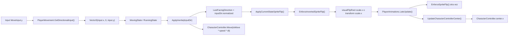

# Player Z Movement Debug Board

Objetivo de mañana: corregir el giro izquierda/derecha del player sobre el eje Z sin introducir saltos de posicion ni romper el sistema de escala por profundidad.

## Flujo actual



## Punto sensible

El proyecto usa Z como izquierda/derecha visual. El giro no deberia cambiar `transform.position.z` de golpe; solo deberia cambiar la direccion visual o el signo de `localScale.x`.

La zona de riesgo esta en la combinacion:

```text
PlayerMovement.ApplyInertia()
PlayerMovement.EnforceInvertedSpriteFlip()
PlayerMovement.ApplyBodyScaleSign()
PlayerAnimations.LateUpdate()
PlayerAnimations.UpdateCharacterControllerCenter()
CharacterController.center.x
```

## Hipotesis para descartar

| ID | Hipotesis | Como descartarla | Senal de confirmacion | Estado |
|---|---|---|---|---|
| H1 | El `visualFlipRoot` no esta asignado y se esta flipeando el GameObject principal del player. | Revisar prefab `Protagonist` y comprobar si `visualFlipRoot` apunta a un hijo visual. | Si esta vacio, `ApplyBodyScaleSign()` toca `transform.localScale.x` y compensa `CharacterController.center`. | Confirmado y mitigado: ahora usa `SpriteRenderer.flipX` como fallback |
| H2 | El salto viene de cambios en `CharacterController.center.x`; con el root rotado ~90 grados en Y, ese centro local X se proyecta como desplazamiento en Z. | Revisar prefab y `PlayerAnimations.UpdateCharacterControllerCenter()`. | `center.x` puede pasar entre `defaultCenterX = -1` e `idleFrontCenterX = 0`, generando desplazamiento aparente sobre Z. | Confirmado y mitigado: `lockControllerCenterX` bloquea cambios dinamicos de centro |
| H3 | `PlayerMovement` y `PlayerAnimations.LateUpdate` estan aplicando el flip dos veces en el mismo frame. | Loggear quien llama a `EnforceInvertedSpriteFlip()` y en que orden. | Se ve flip en `ApplyInertia()` y luego otro ajuste en `LateUpdate()`. | Pendiente |
| H4 | El video nuevo de movimiento esta ocultando el sprite, pero no esta heredando bien el flip visual. | Desactivar temporalmente `PlayerMovementVideoRenderer` y probar solo Animator/Sprite. | Sin video gira bien; con video se queda mirando igual. | Mitigado: componente de video desactivado en prefab para esta prueba |
| H5 | La transicion Animator walk/run izquierda-derecha mueve root/collider por una curva antigua. | Revisar clips/animaciones de walk/run y curvas que afecten transform/collider. | El salto ocurre al entrar en un clip concreto, aunque el codigo de movimiento no cambie Z. | Descartado por ahora: los clips revisados no tienen curvas de posicion, rotacion ni escala |
| H6 | `LastFacingDirection.z` se actualiza con el input correcto, pero el sprite usado tiene orientacion base invertida. | Probar solo el signo esperado con un debug visual de `LastFacingDirection.z`. | El valor cambia bien, pero el personaje sigue mirando a la izquierda. | Pendiente |

## Pruebas minimas

1. Probar sin video de movimiento.
2. Probar con `visualFlipRoot` asignado a un hijo visual, no al root con `CharacterController`.
3. Loggear un solo frame al pulsar direccion contraria:

```text
BeforeFlip: position.z, localScale.x, cc.center.x, LastFacingDirection.z
AfterFlip:  position.z, localScale.x, cc.center.x, LastFacingDirection.z
AfterMove:  position.z, localScale.x, cc.center.x, LastFacingDirection.z
```

4. Confirmar si el salto ocurre en `MovingState`, `RunningState` o ambos.
5. Confirmar si el salto ocurre solo al cambiar de direccion Z o tambien al cambiar X.

## Decision probable

La solucion mas limpia deberia ser:

```text
Root del player:
  - mantiene CharacterController
  - mantiene escala de profundidad
  - no se usa para flip visual si podemos evitarlo

Hijo visual:
  - recibe solo el flip en localScale.x
  - no mueve collider
  - puede contener SpriteRenderer / Animator / superficie de video
```

Esto separa la fisica del player de la orientacion visual. En un juego 2.5D es especialmente importante porque el mismo `transform.localScale` ya se usa para profundidad.

## Referencias de codigo

```text
F:\FattoPrizzervaLightning\Assets\Scripts\CharacterScripts\Player\Player_Classified\PlayerMovement.cs
F:\FattoPrizzervaLightning\Assets\Scripts\CharacterScripts\Player\Player_Classified\PlayerAnimations.cs
F:\FattoPrizzervaLightning\Assets\Scripts\CharacterScripts\Player\Player_Classified\PlayerDepthScaler.cs
F:\FattoPrizzervaLightning\Assets\Scripts\CharacterScripts\Player\StateMachine\States\MovingState.cs
F:\FattoPrizzervaLightning\Assets\Scripts\CharacterScripts\Player\StateMachine\States\RunningState.cs
F:\FattoPrizzervaLightning\Assets\Scripts\CharacterScripts\Player\Player_Classified\PlayerMovementVideoRenderer.cs
```
